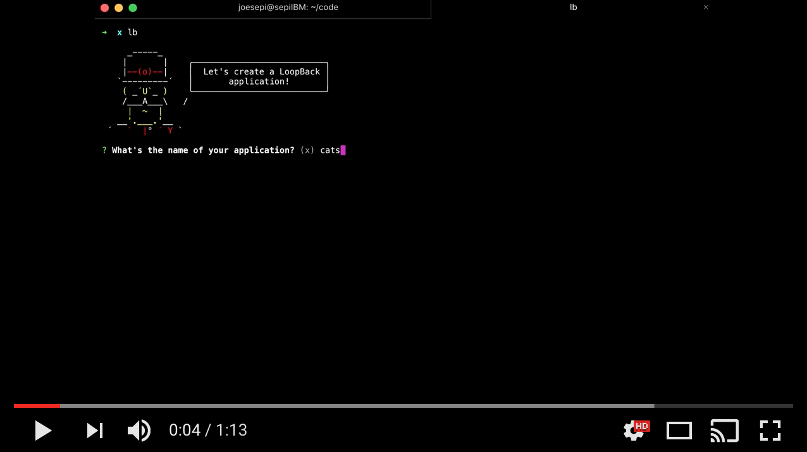

## What is LoopBack?

LoopBack is an open-source framework to rapidly build RESTful APIs in Node.js.  It has a command line interface (CLI) tool that you can use to scaffold your application and build out your API layer based on your data (a model-driven approach). It isn't just fast and easy; it's also robust and extensible. It is built on top of Express, so it has widely-used and battle-tested foundation.

**_LoopBack is so awesome, it is almost magical. Let me show you by building an API in 73 seconds:_**

[](https://youtu.be/iOMD27DjuO4 "Rapid APIs in LoopBack")

## Prerequisites

#### Node.js and NPM

As mentioned previously, we will need Node.js installed on our local machine for development. Included with Node.js is NPM, the Node Package Manager. We will use NPM to install LoopBack in a moment, first lets see if we have Node and NPM:

Check for Node:

```
✗ node --version
v6.2.2
```

This should yield a version number. A number greater than 4 should suffice. If you do not have Node installed, see [nodejs.org](https://nodejs.org) for more details on getting it for your platform.

To be safe, let's check NPM as well:

```
✗ npm --version
4.2.0
```

This should also yield a version number; anything greater than 3 is preferable. If you do not have NPM, you likely do not have Node. If so, see above. If you have Node and not NPM, please reinstall Node.

#### LoopBack CLI

Once we have confirmed we have Node.js and NPM, let's install the LoopBack CLI:

```
npm install -g loopback-cli
```

This will install the LoopBack CLI globally (`-g`) to your machine so you can start a LoopBack application in any directory you choose.

Now confirm it's installed:

```
✗ lb --version
2.2.0 (generator-loopback@3.2.0 loopback-workspace@3.40.1)
```

This should show a version number for the LoopBack CLI. Any version number should do. 

Type `lb --help` to show all sorts of helpful information:

```
✗ lb --help
Usage:
  lb app [options] [<name>]

Options:
  -h,   --help             # Print the generator's options and usage
        --skip-cache       # Do not remember prompt answers                          Default: false
        --skip-install     # Do not automatically install dependencies               Default: false
        --skip-next-steps  # Do not print "next steps" info
        --explorer         # Add Loopback Explorer to the project (true by default)

Arguments:
  name  # Name of the application to scaffold.  Type: String  Required: false

Description:
  Creates a LoopBack application.

Example:

  lb

  This will create:

    package.json: Development packages installed by npm.

    common/models/<modelName>.json: Definition of basic models provided by LoopBack.
    common/models/: Directory where to put custom model code.

    server/server.js: The main application file.
    server/config.json: Machine-editable app configuration.
    server/datasources.json: Definition of data sources.
    server/model-config.json: Model configuration.

Available commands:

  lb acl
  lb app
  lb boot-script
  lb datasource
  lb export-api-def
  lb middleware
  lb model
  lb property
  lb relation
  lb remote-method
  lb swagger
  lb soap
```

Note those 'Availalbe commands'. We will begin using a number of them shortly.

Next Step: [Let's initialize our application](01-init.md).
