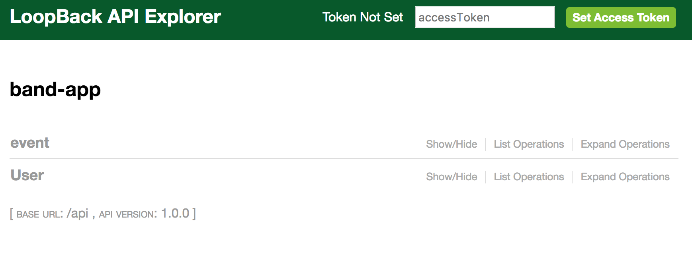
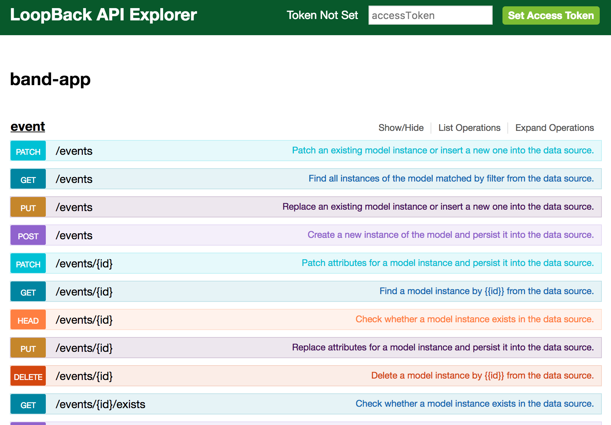
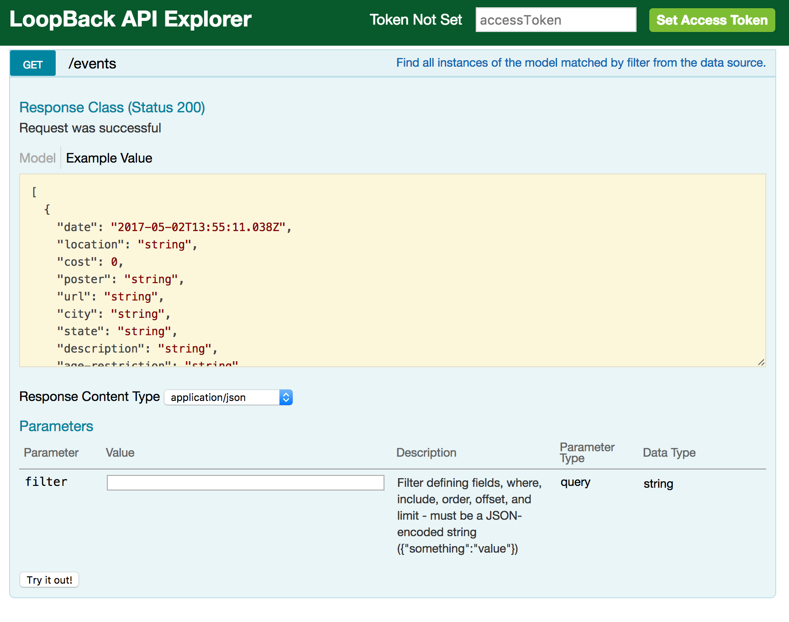
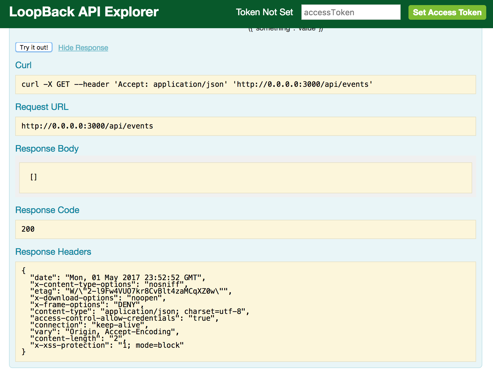
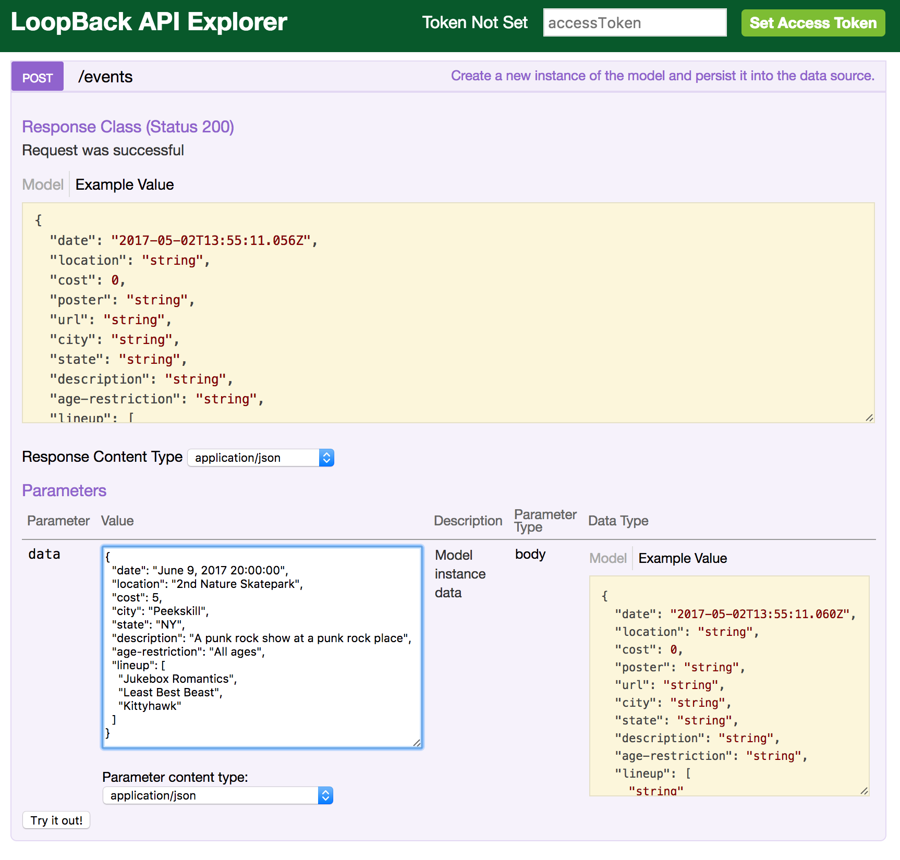
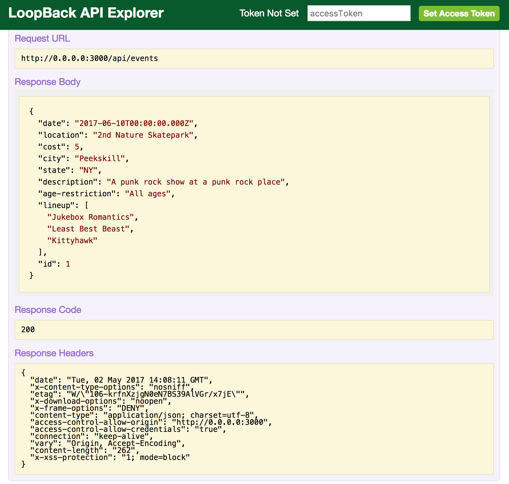
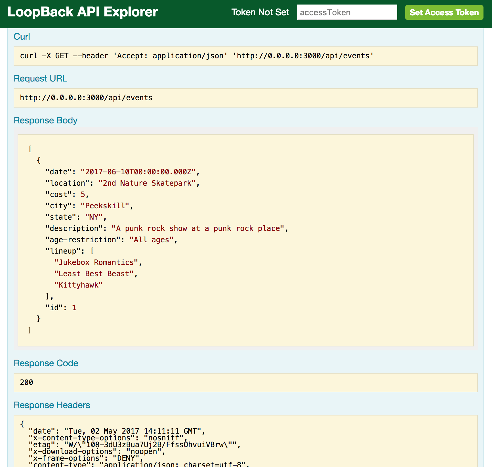

# Exploring the API Explorer

We've initialized a LoopBack application and built our first model-driven RESTful API endpoint for `events`. Let's run the application using `node .` and take a look at the API Explorer UI.


### Start our application

```
➜  band-app git:(master) ✗ node .
Web server listening at: http://0.0.0.0:3000
Browse your REST API at http://0.0.0.0:3000/explorer
```

As we can see above, we have started our node.js application -- upon startup, it helpfully tells us what URL our application is using as well as the URL to the API Explorer. Let's click on the Explorer URL and engage with our endpoints.

_Pro tip: most terminal applications will launch a URL if you `cmd + click` on the text._

### API Explorer



The browser opens up to a page that lists our API endpoints. We'll see one for `event` and one for `User`.

The **User** endpoint is the base class that is provided by the `api server` option we chose when initializing our application. It is the class that we would extend from when making any sort of user-based role; `members`, for example.

_Pro tip: a programming convention is to name Base classes with a capital letter. Reminder: Base classes are the ones that you do not edit directly, but instead extend from._

The **event** endpoint is the one created in the previous step based on our answers to the prompts.

### Our first endpoint: `event`



This is where the magic of LoopBack shines through for those just getting started. Based on the questions related to our model, we are given this full CRUD RESTful API. Let's take this moment to appreciate LoopBack: we haven't written any code yet. ✨MAGIC✨ (And some super-smart generator actions.)

### A `GET` request



If we open up the details of the `GET` request panel in our explorer, we will see some details of our model schema, a parameter section (we'll get to later), as well as a button to "Try it out!"

### A `GET` request - Try it out!

Clicking the "Try it out!" button makes a `GET` request to our `event` endpoint:



In addition to providing some request examples (Curl and URL), we also see that the `GET` request is successful with a `200` response, but the response array is empty. That's because we don't have any data! We've only described our data, but we haven't actually added any to our data-source. Let's try adding some data using the `POST` method.

*Pro tip: To learn more about HTTP responses, check out this [list of http status codes](https://en.wikipedia.org/wiki/List_of_HTTP_status_codes). One of my personal favorites is `418 - I'm a teapot`.*

### A POST call - add some data



If we scroll the page down the list of HTTP verbs, we will see a few POST options. The first one should be `POST /events`. Let's open that panel by clicking on it and we should see a similar panel to the GET one we saw above.

### A `POST` request - Try it out!

We can click on the text field with the yellow background in the Parameters section. Doing so will populate the text field (with the white background) with example data. In the image above, I edited the example data like so:

```json
{
  "date": "June 9, 2017 20:00:00",
  "location": "2nd Nature Skatepark",
  "cost": 5,
  "city": "Peekskill",
  "state": "NY",
  "description": "A punk rock show at a punk rock place",
  "age-restriction": "All ages",
  "lineup": [
    "Jukebox Romantics",
    "Least Best Beast",
    "Kittyhawk"
  ]
}

```

There are a few things to notice in our data:

- it is trimmed: everything in this model is optional
- the `id` key/value in the data is removed: if we send an `id`, we may get an error because that field is managed by the data source
- the date is formatted differently than the sample data: LoopBack handles dates rather nicely

After entering this data into the text field, we can click the 'Try it out!' button to `POST` this data to the endpoint.



If the request is successful (as it should be), we get a `200` response and the response body includes the data we sent with an actual `id` returned. To verify the successful `POST`, go back to the `GET` request and "Try it out!"



Yay! Again, we get the `200` response and this time, the `GET` request returns an array with the object we had submitted in the previous step. Exciting, right?

This is all working really well. Let's get it up on a server so we can take it to the next level.

**Next Step:** [Deploy](05-deploy.md)

