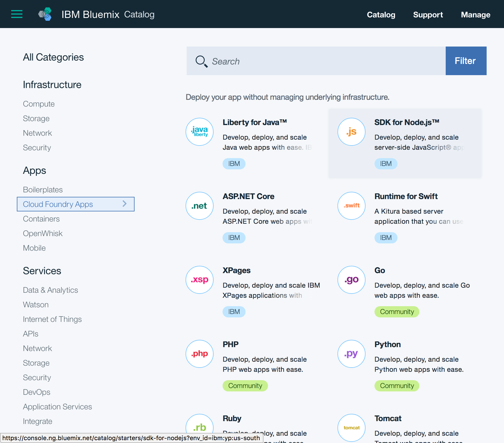
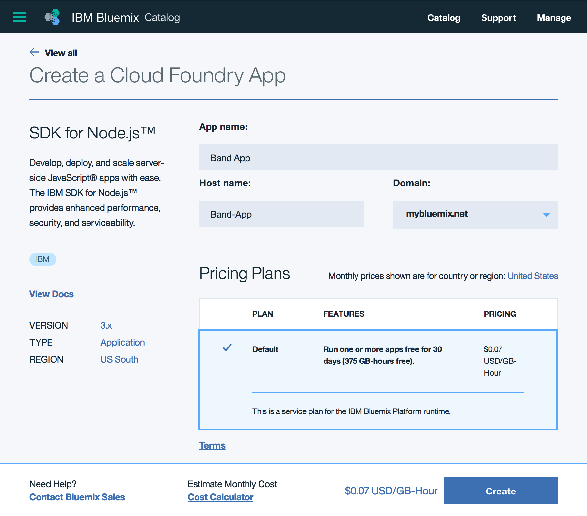

# Deploy

🖥 To see the code for this step, here is [commit/diff](https://github.com/StrongLoop-Evangelists/band-app/commit/b065a8854831c44371aa2c49bc9f365ffd6f2b68
).

---

A LoopBack app is simply a Node.js app. For our purposes, we will deploy our code to [Bluemix](https://bluemix.net), IBM's PaaS (platform as a service), but we could deploy it wherever Node.js is supported. If we were to deploy our app to a conventional server, we would need to make sure the tools were in place to keep our app running and able to handle any sort of load it may need to withstand. Fortunately, Bluemix handles all of that for us. And we can use their Cloud Foundry tools to configure and manage the deployment.

## Create Node.js Cloud Foundry app:

In this step, we need to go into the [Bluemix catalog](https://console.ng.bluemix.net/catalog/) and from the Cloud Foundry section we will choose to create a Node.js Runtime App:



### Create the Node.js app

Choosing the SDK for Node.js takes us to a page where we can name our application as well as choose the Bluemix route to access our app:



*Note: take notice of the org and space you created this app in on Bluemix. It is likely you only have one of each, but it is not uncommon to have more than one of one or the other. Which org/space you are currently in is where the app will be created.*

The next page presented to us after creating our Node.js app shows the app starting up. On this page, we will also see some instructions for using a sample app and getting started. We are going to skip that in favor of the following steps:

## Prepare our app and local environment

We can now switch back to the terminal and our editor to get our local environment prepped and our application set up.

### Create our `manifest.yml` file

Let's go into the root of our LoopBack application and create a `manifest.yml` file and add the following information, changing "name" to the name we chose when creating the Cloud Foundry app.

It should look something like so:

```yaml
name: Band-App
memory: 256M
```

### Get Cloud Foundry

At this point, we are going to begin using the Cloud Foundry cli, so we'll need to get that installed before going further.

The most common way of installing Cloud Foundry on a Mac is to use Homebrew:

```bash
$ brew tap cloudfoundry/tap
$ brew install cf-cli
```

To find instructions for other platforms, see [Cloud Foundry CLI downloads page](https://github.com/cloudfoundry/cli#downloads)

### Login `cf login`

The first thing we need to do is log in. Doing so, it will prompt us for email, password, organization and space.

In the terminal, let's run `cf login`:

```bash
➜  band-app git:(master) ✗ cf login
API endpoint: https://api.ng.bluemix.net

Email> joesepi@ibm.com

Password>
Authenticating...
OK

Select an org (or press enter to skip):
1. StrongLoop Evangelists Org
2. Some Total

Org> 1
Targeted org StrongLoop Evangelists Org

Select a space (or press enter to skip):
1. dev
2. acme-freight
3. Band App

Space> 3
Targeted space Band App


API endpoint:   https://api.ng.bluemix.net (API version: 2.54.0)
User:           joesepi@ibm.com
Org:            StrongLoop Evangelists Org
Space:          Band App
```

Looks like we were successful.

## Deploy!

### Push our code `cf push`

We can push our code to Bluemix by running the `cf push` command. Doing so will use our `manifest.yml` file and the settings we have just chosen to deploy our app in the cloud.

```bash
➜  band-app git:(master) ✗ cf push
Using manifest file /Users/joesepi/code/band-app/manifest.yml

Updating app Band-App in org StrongLoop Evangelists Org / space Band App as joesepi@ibm.com...
OK

Uploading band-app...
Uploading app files from: /Users/joesepi/code/band-app
Uploading 11.1M, 11337 files
Done uploading
OK

Stopping app band-app in org StrongLoop Evangelists Org / space Band App as joesepi@ibm.com...
OK

Starting app band-app in org StrongLoop Evangelists Org / space Band App as joesepi@ibm.com...
```

Beyond this, there is a lot of output about things downloading and such, but after the app is prepared and then started, we will something along these lines in your terminal:

```
Staging complete
Exit status 0
Uploading droplet, build artifacts cache...
Uploading build artifacts cache...
Uploading droplet...
Uploaded build artifacts cache (12.2M)
Uploaded droplet (29M)
Uploading complete

0 of 1 instances running, 1 starting
0 of 1 instances running, 1 starting
0 of 1 instances running, 1 starting
1 of 1 instances running

App started


OK

App band-app was started using this command `./vendor/initial_startup.rb`

Showing health and status for app band-app in org StrongLoop Evangelists Org / space Band App as joesepi@ibm.com...
OK

requested state: started
instances: 1/1
usage: 256M x 1 instances
urls: Band-App.mybluemix.net
last uploaded: Tue Apr 18 03:27:35 UTC 2017
stack: cflinuxfs2
buildpack: SDK for Node.js(TM) (ibm-node.js-4.8.0, buildpack-v3.11-20170303-1144)

     state     since                    cpu    memory           disk           details
#0   running   2017-04-17 11:29:22 PM   0.0%   123.9M of 256M   144.1M of 1G
```

At this point, our app is in the cloud and we can visit the app at the urls stated in the output above: `urls: band-app.mybluemix.net` (*your url may be slightly different*)

### Show our app status `cf apps`

And at any point, we can check our apps by running `cf apps`. The output should looks something like:

```bash
➜  band-app git:(master) ✗ cf apps
Getting apps in org StrongLoop Evangelists Org / space Band App as joesepi@ibm.com...
OK

name       requested state   instances   memory   disk   urls
band-app   started           1/1         256M     1G     Band-App.mybluemix.net
```

If we go to our [Band App on Bluemix](https://band-app.bluemix.net), we will see the status output that is the default for a LoopBack app. And if we view the [LoopBack Explorer for our API](https://band-app.bluemix.net/explorer)(`/explorer`), we should see the familiar interface.

**Next Step:** [Connect a datasource](06-datasource.md)
